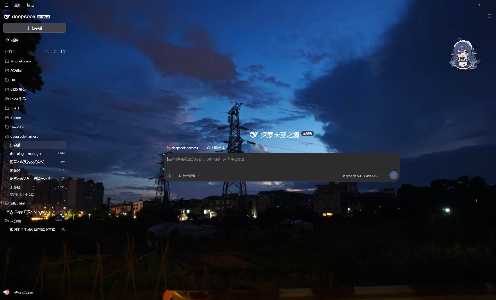
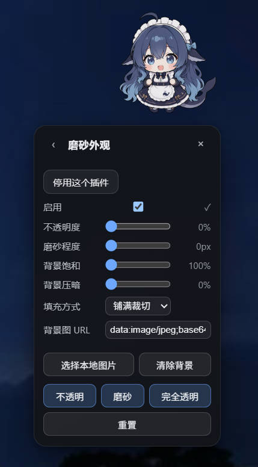
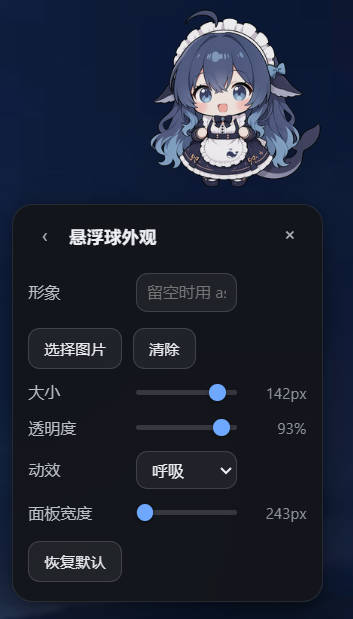

# dsh-plugin-manager


一个给 [DeepSeek Harness](https://github.com/deepseek-ai/deepseek-harness) 用的**插件管理器**——以一颗可拖动的悬浮球的形式待在你的界面上。

插件只要在自己的 `package.json` 里声明一段 [`dsh.ball`](packages/dsh-client-ui-ball/PROTOCOL.md)，就被它接管：进列表、**自动生成设置表单**、拿到 Plugins 页面的配置卡片、可以一键启用/停用。**插件不用写面板、不用写配置卡片、不用注册 slot。**

> A floating-ball plugin manager for the dsh GUI. A plugin declares `dsh.ball` in its package.json and gets a list entry, a generated settings form, a Plugins-page card, and an enable switch — no panel, card, or slot registration of its own.

> [!IMPORTANT]
> **本项目不是 dsh 自带的 [`@deepseek-ai/dsh-plugin-manager`](https://github.com/deepseek-ai/deepseek-harness/tree/main/packages/boot/plugin-manager)。**
> 那是 Host 侧的 profile 插件管理器（读写 `cordis.patch.yml` 的那个）；本项目的球是**在客户端驱动它**的那张脸——球上那个「停用」按钮走的就是它的 remote。名字撞了，东西不是一回事。

**特性**

- 🐳 **悬浮球是插件管理器**，不是"一个放设置的地方"。插件在 `package.json` 里声明 [`dsh.ball`](packages/dsh-client-ui-ball/PROTOCOL.md) 一段，就会被识别：进列表、**自动生成设置表单**、可启用/停用——**不用写面板、不用写配置卡片、不用注册 slot**
- 👀 **已停用的插件也看得见**。Host 扫的是 manifest 而不是等插件自报，所以"装了但关着"的插件照样列出，带状态标记，能直接在球里打开
- 🎨 **形象可换**：画廊点选、URL、表情符号，或做成带状态的多帧形象包（空闲 / 工作中 / **等你审批** / 刚完成，按会话状态自动切）
- 🪟 **磨砂玻璃**：不透明度、磨砂强度、背景饱和度、背景压暗、背景画面全部实时可调
- 📦 **免构建**：`lib/` 里就是实际执行的代码，克隆下来就能装，不需要任何打包步骤
- ✅ **233 项 jsdom 断言**，覆盖协议、管理动作、跨插件契约与两条降级路径

```
        ╭──────────────────────────╮
        │  设置                 ×  │
        ├──────────────────────────┤
        │  ◐  磨砂外观              │  ← dsh-client-ui-glass
        │  🐳 悬浮球外观            │  ← dsh-client-ui-ball
        │  ⚙  你的插件…             │  ← dsh.ball 声明
        ╰──────────────────────────╯
                    ▲
                  (◕‿◕)
```

## 看看它长什么样

球浮在界面右上角；玻璃把面板底色清空，只留你自己设的背景画面：



面板里每一项都由插件的 `dsh.ball` 声明生成，不同插件各占一张卡片——上面那张示意图里的条目，点开就是这两张：

| [`dsh-client-ui-glass`](packages/dsh-client-ui-glass/README.md) 的「磨砂外观」 | [`dsh-client-ui-ball`](packages/dsh-client-ui-ball/README.md) 的「悬浮球外观」 |
|---|---|
|  |  |

## 仓库里有什么

| 包 | 角色 | 能单独装吗 |
|---|---|---|
| [`dsh-client-ui-ball`](packages/dsh-client-ui-ball/README.md) | **主体——管理器本身**。可拖动、可换形象的悬浮球，扫描 `dsh.ball` 清单、渲染设置表单、代理启用/停用。协议规范在 [`PROTOCOL.md`](packages/dsh-client-ui-ball/PROTOCOL.md) | ✅ **可以**，装它一个就够 |
| [`dsh-client-ui-glass`](packages/dsh-client-ui-glass/README.md) | **第一个适配它的插件**：透明磨砂玻璃外观（不透明度 / 磨砂强度 / 背景画面 / 完全透明） | ✅ 可以，带球不带球都能跑 |

**每个包都是独立的**：管理器不依赖任何一个插件，插件也不依赖管理器——没有球时玻璃退回自带的悬浮按钮，有球时它把面板和配置卡片都交给球。所以你可以只装管理器，也可以只装某一个插件。

后续适配悬浮球的插件都放这个仓库。**球是主体，插件是围绕它的赠品**——每加一个插件，球不用改一行代码。

两者都是**免构建**的纯 JavaScript：Host 半边是普通 ESM，浏览器半边是手写的 `window.__ModuleLoader__.load({ id, factory })` 闭包工厂——也就是 dsh 官方 tsdown 客户端预设产物遵守的同一注册协议。dsh 仓库的 `packages/client/tsdown.client.ts` 预设没有对外发布，第三方包只能自带打包器或手写这个包装，这里选择手写。

> **许可分层**：代码 MIT，[`assets/mascot.png`](packages/dsh-client-ui-ball/assets/mascot.png) 与 [`assets/packs/`](packages/dsh-client-ui-ball/assets/packs) 里的形象单独按 CC BY-NC-SA 4.0。详见[文末](#许可)与 [`NOTICE.md`](NOTICE.md)。

---

## 快速开始

### 1. 安装到 profile

```powershell
# 全都装上（管理器 + 附赠的磨砂玻璃）
./scripts/install.ps1

# 只要管理器——别人做的插件照样能接进来
./scripts/install.ps1 -Only dsh-client-ui-ball

# 只要某一个附赠插件（不装管理器也能跑）
./scripts/install.ps1 -Only dsh-client-ui-glass
./scripts/install.ps1 -Only ui-glass          # 行 id 也行

# 装进 Web 版 profile
./scripts/install.ps1 -Profile web

# 指定 Harness home（默认读 $env:DSH_HOME，再退回 ~/.dsh）
./scripts/install.ps1 -DshHome 'D:\dsh-home'
```

脚本做两件事：把包复制进 `<profile>/node_modules/`，并按**磁盘上实际装了哪些包**重建 `<profile>/cordis.patch.yml` 里那段带标记的 bundle 块。所以**可重复执行**，也可以分几次增量装——第二次只装玻璃时，球那一行不会被弄丢。

```powershell
./scripts/uninstall.ps1                      # 全卸
./scripts/uninstall.ps1 -Only ui-glass       # 只卸玻璃，球留着
```

### 2. 给 AI agent 的安装说明

把下面整段丢给你的编码 agent（Claude Code / Codex / Cursor / dsh 本身都行），它会自己完成安装：

````text
把这个仓库的 dsh 插件装进本机的 dsh：https://github.com/NeitherTourRest/dsh-plugin-manager

要求：
1. 先读 README.md 的「快速开始」和 packages/dsh-client-ui-ball/PROTOCOL.md。
2. 确认 $DSH_HOME（未设置则默认 ~/.dsh），并列出 $DSH_HOME/profiles/ 下已有的 profile。
   桌面版 profile 名是 desktop。
3. 用仓库自带的脚本安装，不要手写 cordis.patch.yml：
     pwsh -File scripts/install.ps1 -Profile <profile> [-Only <包名或行id>]
   只装 dsh-client-ui-ball 即为「只要插件管理器」。
4. 脚本必须能重复执行且不产生重复的 insert 块。装完请检查
   <profile>/cordis.patch.yml 里 `- insert:` 只出现一次，且每个已装包各有一行。
5. 告诉我：装进了哪个 profile、装了哪些包、需要重启 dsh 还是刷新页面即可。

不要修改仓库里的任何文件；不要动 profile 里 cordis.patch.yml 标记块以外的内容。
````

### 3. 生效

改了 `cordis.patch.yml` 的**插件行**（安装/卸载/启用/停用）→ 重启 dsh。
只改了插件的 `lib/client.js`（浏览器半边）→ 刷新页面即可。

### 4. 也可以用桌面版 Plugins 页面

每个包都声明了 `dsh.bundle.patch`，所以在侧边栏 **Plugins → 添加插件** 里填仓库内对应包的绝对路径同样可以安装，依赖会被正确登记。装好后该行会出现 **Configure** 按钮——这就是官方的插件配置入口。

只装其中一个包也完全可以，它们之间没有依赖。

---

## 做一个能被管理器识别的插件

**你不需要依赖本仓库的任何代码，也不需要装什么。** 只要在你自己的 `package.json` 里声明一段 `dsh.ball`，悬浮球就会认出你：

```json
{
  "name": "my-dsh-plugin",
  "exports": { ".": "./lib/index.js", "./client": "./lib/client.js" },
  "dsh": {
    "client": { "platform": "web" },
    "bundle": { "patch": "./cordis.patch.yml" },
    "ball": {
      "id": "my-plugin",
      "title": { "zh": "我的插件", "en": "My plugin" },
      "icon": "⚙",
      "order": 20,
      "settings": {
        "namespace": "my-plugin",
        "fields": [
          { "key": "enabled", "kind": "toggle", "label": { "zh": "启用", "en": "Enabled" } },
          { "key": "level", "kind": "range", "min": 0, "max": 10, "step": 1, "unit": "级",
            "label": { "zh": "等级", "en": "Level" } },
          { "key": "mode", "kind": "select", "label": { "zh": "模式", "en": "Mode" },
            "options": [{ "value": "a", "label": { "zh": "甲", "en": "A" } }] },
          { "key": "art", "kind": "image", "label": { "zh": "图片", "en": "Image" } }
        ]
      }
    }
  }
}
```

**声明完就结束了。** 悬浮球会替你：

- 把模块列进菜单——**即使你的客户端半边没在运行**（它扫的是 manifest，不是等你自报）
- 从 `fields` **自动生成设置表单**并写进你的 settings 命名空间
- 在 Plugins 页面**注册配置卡片**（`<包名>#<行id>`）
- 提供**启用 / 停用**（走 dsh 自己的 plugin manager remote）与**恢复默认**

五种字段类型：`toggle` / `range` / `select` / `text` / `image`（自带文件选择器）。
完整规范——清单每个字段、目录线格式、管理动作、形象包、兼容规则——见 **[`PROTOCOL.md`](packages/dsh-client-ui-ball/PROTOCOL.md)**。

需要自定义面板时，再在客户端半边注册一个实时面板即可，**实时面板优先于声明生成的表单**：

```js
const ball = ctx.get('ball')
ctx.effect(() => ball.register({
  id: 'my-plugin',                    // 必须与清单里的 id 一致
  label: () => t('panel'),
  render(container, api) {
    container.append(myPanel())
    return () => { /* 离开面板时清理 */ }
  },
}), 'my-plugin: ball panel')
```

> ⚠️ **在你的客户端半边里，服务一律用 `ctx.inject` 获取，不要用 `ctx.get`。**
> 客户端插件在 `apply()` 运行时，别的插件往往还没激活：`ctx.get('theme')` 会返回 `undefined` 并**永远保持 undefined**。
> 这一类错误的表现是「重启后失效、停用再启用就好了」，极难排查。用 `ctx.inject(['theme'], ctx => …)` 才会等待服务就绪。
> 本仓库的玻璃插件就踩过这个坑——`theme` 和 `settingsScope` 各一次。

---

## 面板作者的几点提醒

- 只有一个面板时点球**直接进面板**，多个才显示列表。
- 面板**切走即销毁**（调用你返回的清理函数），切回来重新 `render`。不要假设面板 DOM 会一直存在。
- 球的面板内容在球的 shadow root 里，**文档级样式表穿不进去**——面板请自带 shadow root（[`dsh-client-ui-glass`](packages/dsh-client-ui-glass/lib/client.js) 就是这么做的，可以直接抄）。
- 等球可用用 `ctx.inject(['ball'], …)`，不要用 `ctx.get('ball')`：装包顺序就无所谓了。

---

## 文档

| 我想 | 看 |
|---|---|
| 装上它 / 让 AI agent 帮我装 | [`docs/install.md`](docs/install.md) |
| **做一个能被管理器识别的插件** | [`docs/making-a-plugin.md`](docs/making-a-plugin.md) |
| 往本仓库加一个附赠插件 | [`docs/adding-a-bundled-plugin.md`](docs/adding-a-bundled-plugin.md) |
| 知道它内部怎么运作 | [`docs/architecture.md`](docs/architecture.md) |
| 出问题了 | [`docs/troubleshooting.md`](docs/troubleshooting.md) |
| 查 `dsh.ball` 的规范条文 | [`PROTOCOL.md`](packages/dsh-client-ui-ball/PROTOCOL.md) |

全部文档的索引在 [`docs/`](docs/README.md)。

---

## 统一设置

两个包都接入 dsh 官方设置体系，而不是自建存储：

| 层 | 用的东西 |
|---|---|
| Host 半边 | `ctx.settings.register(ns, schema)` → 持久化到 `$DSH_HOME/settings.yaml` |
| 浏览器半边 | `ctx.settingsScope.bind({ namespace })`，服务不可用时退回 `localStorage` |
| Plugins 页面 | 悬浮球按声明**替你注册** `plugins.row.config` 卡片，key = `<包名>#<行id>` |
| 文案 | `ctx.locale.register(ns, { zh, en })`，卡片通过 `t` 取词 |

滑块与拖动都是**只改本地、松手落盘一次**，指针节奏不会打到 settings 线路上。

---

## 开发与测试

没有构建步骤——`lib/` 里就是实际执行的代码。改完直接重新安装即可（或从 profile 里的副本改）。

```sh
npm install     # 只为测试装 jsdom
npm test        # 四个 jsdom 验证脚本
```

| 脚本 | 覆盖 |
|---|---|
| `test/verify-ball.mjs` | 83 项：注册协议、`ctx.ball` 服务契约、**声明目录合并与状态标记**、**通用设置表单**、**替模块注册配置卡片**、**启用动作**、形象包与状态切换、设置采纳与上迁、拖动、卸载 |
| `test/verify-ball-host.mjs` | 67 项：**`dsh.ball` 清单扫描器**（对着三个真实 fixture 包）、**形象包索引与资源路由**（含路径穿越拒绝）、自带素材的字节与 content-type、405/404/HEAD |
| `test/verify-glass.mjs` | 68 项：**带球时把卡片让给悬浮球 / 不带球时自带卡片与按钮**、**升级路径**（schema 默认值不得抹掉本地镜像，且本地值应上迁）、主题令牌层、背景层、面板交互、卸载 |
| `test/verify-together.mjs` | 15 项：把两个包加载进同一个文档，用**真实的 `ctx.ball` 服务**驱动玻璃面板——验证跨插件契约本身 |

共 233 项。它们验证**行为与协议**，不验证视觉观感。磨砂强度合不合意得在真机上对着自己的壁纸调。

---

## 兼容性

- 需要 dsh 的客户端插件契约：`dsh.client.platform`、`exports["./client"]`、`window.__ModuleLoader__` 注册协议。
- 半透明依赖 `color-mix()` 与 `backdrop-filter`（Chromium 111+；桌面版 Electron 44 满足）。
- 分别在 **dsh 桌面版（打包版，Windows）** 上实测安装并热加载成功：两个 Host 行 active、两个客户端半边 active、两张 `plugins.row.config` 卡片注册成功。

---

## 已知限制

**Windows 上无法真正"看见背后窗口"。** Electron 的窗口透明（`transparent`）、亚克力/云母材质（`backgroundMaterial`）、整窗透明度（`setOpacity`）只能在 **Electron 主进程**里设置。dsh 插件运行在 Host 子进程和渲染进程，仓库里不存在任何让插件触达主进程窗口的扩展点：`packages/**` 没有 `import … from 'electron'`；Host 是 `ELECTRON_RUN_AS_NODE=1` 的独立子进程；Host 乱发 IPC 会被判定非法并直接 SIGTERM；渲染进程只有一个只读的 `window.dshDesktop`。

所以 Windows 上「完全透明」的实际含义是**清空所有面板底色、只显示你设置的背景画面**——这正是磨砂玻璃的常规做法。macOS 例外：桌面版窗口本身已是 `backgroundColor: '#00000000'` + vibrancy，清空后能真的透出桌面。

**这些是外部包，不是 dsh 官方包。** 协议层完全合规（用的全是文档化契约），但不遵守 dsh 仓库对一等包的部分规范：包名不是 `@deepseek-ai/dsh-client-*`、UI 走 Shadow DOM 而非 slot、样式不走 CSS Modules。要合入官方仓库需要按那套规范重做。

其它限制见各包 README 的「已知限制」一节。

---

## 许可

**本仓库不是单一许可**，按文件分层：

| 范围 | 许可 |
|---|---|
| 代码（`packages/**/lib/**`、`cordis.patch.yml`、`scripts/**`、`test/**`、文档） | **[MIT](LICENSE)** |
| `packages/dsh-client-ui-ball/assets/mascot.png` | **[CC BY-NC-SA 4.0](https://creativecommons.org/licenses/by-nc-sa/4.0/deed.zh)**（署名 · **禁止商用** · 相同方式共享） |

`mascot.png` 是社区「鲸鱼娘」形象：角色原型为画师**上善无形**的原创 OC「溟月」，
**ZipZipPipe** 做了 DeepSeek 元素二创，**QYQCAMIAO** 做了去伪影修复。
完整来源、署名、本仓库所做的修改，见 **[`NOTICE.md`](NOTICE.md)**。

CC 的 ShareAlike **不会传染到代码**——图片与代码是彼此独立的作品，同仓属于聚合而非演绎，
所以「代码 MIT + 素材 CC BY-NC-SA」是合法且常见的组合。

**要以纯 MIT 分发，或者要商用**：删掉 `packages/dsh-client-ui-ball/assets/mascot.png` 即可。
悬浮球会回落到**内置的原创 SVG**——那只鲸鱼兜帽造型是本项目自己画的，随 MIT 分发，
也不是上述角色、不是 DeepSeek 官方素材。

两个插件与 DeepSeek 官方无隶属关系。

> 若你是权利人并认为此处使用不妥，请开 Issue，我们会立即移除该图片。
